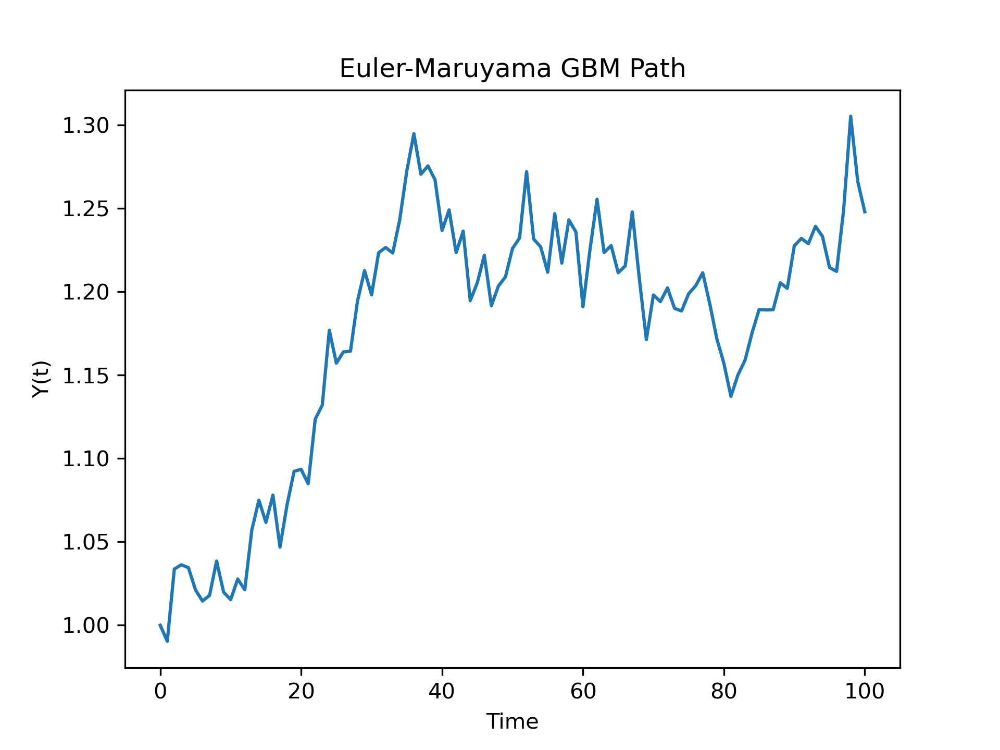

# PYGBM: Brownian Motion
This package simulates Brownian Motion using three different methods:
<li>Geometric Brownian Motion</li>
<li>Euler-Maruyma Method</li>
<li>Milstein Method</li>

## Example usage:

    pygbm simulate --y0 1.0 --mu 0.05 --sigma 0.2 --T 1.0 --N 100 --method euler --output gbm_plot.png

This simulates Brownian motion over 100 time steps using the Euler-Maruyma method and saves the output as a graph in the file `gbm_plot.png`.

